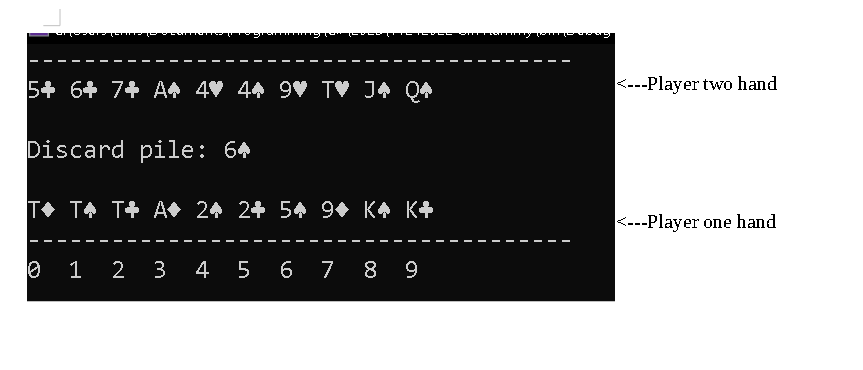

# Gin-Rummy-CLI

Command-line game of gin rummy. The command line always shows both players hands purely for demonstration and verification purposes.

Everything in this repo was written from scratch by myself. Algorithms are implemented to ensure that the optimal meld combinations are always selected such that
both player's hand values are minimized. 

### *CODE EXPLANATION*

Three options of play exist:

- Two humans play against each other
- **[DEFAULT OPTION]** One human plays against a simple AI agent (*player one is human, player two is AI agent*)
- Two simple AI agents play against each other (*console print outs are currently commented out so nothing is displayed in the command line*)

Play option is determined by commenting/uncommenting the relevant code section in [Program.cs](https://github.com/ConkyTheGreat/11242022-Gin-Rummy/blob/master/Program.cs)

If wanting to play a game where you cannot see the opponents hand, the "WriteLine()" lines of the relevant PrintHandsToConsole() methods should be commented out. 

The simple AI agent operates on this ruleset:
- If the card on the discard pile completes a meld, pick it up. Otherwise pick up from the deck.
- Always discard the card that has the highest value and is not in a meld.  
- During the first-pickup-chance turn immediately after the cards are dealt out, if the discard pile card has a lower value than the highest value card in the agent's hand that is not in a meld, then pick it up and discard the highest value card.
- Always knock as soon as possible

### *HOW TO RUN*

- Easiest way: download and run the .exe file from the Releases section
- Or download this repository and install/run
